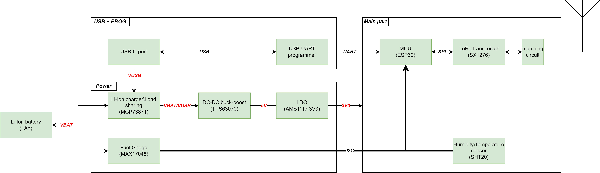

# LoRa Sensor TAG

Simple LoRa humidity and temperature monitoring device, based on the ESP32-Wroom-D SoC module.
Repo contains KiCAD 10 project for LoRa Sensor TAG device with external component libs.

## Project description

The architecture of the project is described with the diagram below (lora_sensor_tag_architecture.jpg):

The LoRa Sensor Project is designed to create a network of low-power, long-range sensors for environmental monitoring. 
The project aims to leverage LoRa technology to enable efficient data collection from remote locations, 
providing real-time insights into various environmental parameters such as temperature and humidity.

It is developed simply for the educational purpose, aiming to provide students and hobbyists with hands-on experience in 
building and managing a LoRa-based sensor network.

The device composed of several key components:

- A LoRa module for long-range wireless communication.
- Sensor for measuring environmental parameters such as temperature and humidity.
- A microcontroller to process sensor data and manage communication.
- A power source (li-ion battery) with DC-DC buck-boost converter and LDO to manage power supply and ensure stable operation.
- Auxiliary components such as USB-UART bridge for serial communication and programming the microcontroller.

The following key components were used:

- MAX17048G_T10 - Fuel Gauge IC to monitor battery status
- MCP73871-2CAI_ML - Li-Ion/Li-Polymer Battery Charger to manage battery charging and protection
- SHT20 - Temperature and Humidity Sensor to measure environmental conditions
- SX1276IMLTRT - LoRa Transceiver Module to enable long-range wireless communication
- TPS63070RNMR - Buck-Boost Converter to manage power supply and ensure stable operation
- ESP32 - Microcontroller to process sensor data and manage communication
- CP2102 - USB to UART Bridge Controller to enable serial communication between the microcontroller and a computer. Also, acts as a programmer for the microcontroller.